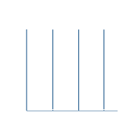

<p align="center"><a href="https://git.io/typing-svg"></a></p>

<p align="center"><a href="https://visitcount.itsvg.in">
  
</a></p>

#  Connect with me

<p align="center">
  <a href="https://www.facebook.com/khoaw.dang" target="blank"></a>
  <a href="mailto:khoadn1109@gmail.com" target="blank"></a>
  <a href="https://www.instagram.com/_dang_khoaw_" target="blank"></a>
  <a href="https://t.me/KhoaMatNao" target="blank"></a>
  <a href="https://www.tiktok.com/@dang.khoaw" target="blank"></a>
</p>

#  About me

```python
class DangDangKhoa:
    def __init__(self):
        self.username = 'dangkhoaw'
        self.fullname = 'Dang Dang Khoa'
        self.location = 'Da Nang, Viet Nam'
        self.role = 'Student'
        self.university = 'University of Science and Technology - The University of Danang (DUT)'
        self.field = 'Information Technology'
        self.interest = 'Cyber Security'

if __name__ == '__main__':
    me = DangDangKhoa()
```

# <a align='left'></a> Github Stats

<div align="center">
  <table>
    <thead>
      <tr>
        <th>
          <a>
            
          </a>
        </th>
        <th>
          <a>
            
          </a>
        </th>
      </tr>
    </thead>
    <tbody>
      <tr>
        <td colspan="2">
          
        </td>
      </tr>
    </tbody>
  </table>
</div>

---

<details><summary><h2> 📂 My reponsitories </h2></summary>

<div>
  <p align="center">
    <a href="https://github.com/dangkhoaw/Student-Management">
      
    </a>
    <a href="https://github.com/dangkhoaw/Net-Management">
      
    </a>
    <a href="https://github.com/dangkhoaw/CTF">
      
    </a>
    <a href="https://github.com/dangkhoaw/ransomware">
      
    </a>
    <a href="https://github.com/dangkhoaw/dangkhoaw">
      
    </a>
  </p>
</div>
</details>
